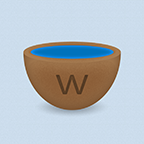

## waterclock
a weather webapp for iPad

## Description

Waterclock is a weather webapp for iPad which uses the Yahoo API to get weather data.

## Requirements

* iPad

## Installation

1. Open index.html

## License

Waterclock is licensed under GPL v2 and this can be found in LICENSE.txt